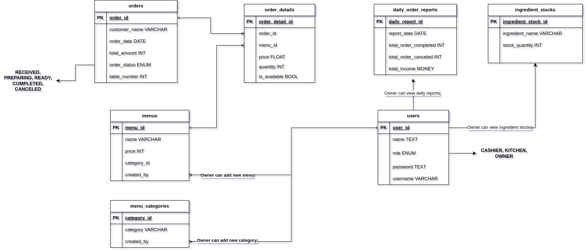

# Aplikasi Rumah Makan

Aplikasi rumah makan adalah aplikasi berbasis web yang akan digunakan oleh internal restoran atau rumah makan untuk mengotomatisasi dan meningkatkan efisiensi operasional mereka. Aplikasi ini dirancang untuk membantu dalam proses pengelolaan pesanan pelanggan, manajemen stok, pelacakan penghasilan, dan menyediakan laporan yang diperlukan untuk analisis bisnis.

## Alur Aplikasi

1.  Pelanggan datang dan mengambil nomor meja:

    Pelanggan tiba di restoran dan mengambil nomor meja sebelum duduk.

2.  Pelayan memberikan menu:

    Pelayan datang ke meja pelanggan dan memberikan menu yang tersedia.

3.  Pelanggan membuat pesanan:

    Pelanggan memilih menu yang diinginkan dari daftar menu yang disediakan.

4.  Pelayan mencatat pesanan:

    Setelah pelanggan menentukan pesanannya, pelayan mencatat pesanan tersebut untuk diteruskan ke kasir.

5.  Kasir membuat pesanan baru:

    Kasir memasukkan pesanan pelanggan ke dalam sistem untuk diproses.

6.  Dapur menerima dan menyiapkan pesanan:

    Pesanan yang diterima oleh kasir langsung diteruskan ke dapur untuk dipersiapkan oleh staf dapur.

7.  Pesanan disajikan kepada pelanggan:

    Setelah pesanan selesai disiapkan, pelayan mengantarkan pesanan ke meja pelanggan.

8.  Pelanggan membayar pesanan:

    Kasir mencetak struk pembelian untuk pelanggan sebagai bukti transaksi.

## Pengguna Aplikasi

1. Pemilik Restoran (Owner):

   Bertanggung jawab atas pengelolaan keseluruhan restoran.
   Memiliki akses penuh ke semua fitur aplikasi, termasuk laporan penghasilan dan manajemen stok.

2. Kasir (Cashier):

   Bertanggung jawab untuk mengelola pesanan pelanggan dan transaksi pembayaran.
   Memiliki akses terbatas untuk membuat dan mengelola pesanan serta mencetak struk pembelian.

3. Staf Dapur (Kitchen):

   Bertanggung jawab untuk menyiapkan pesanan yang masuk dari kasir.
   Menerima notifikasi tentang pesanan baru yang masuk ke dapur dan menyiapkan pesanan sesuai dengan catatan pesanan

## Tech Stack

1. Go Programming Language

   Berdasarkan cakupan projek yang telah ditentukan, Go dapat diandalkan untuk membuat aplikasi web (web app). Dengan dukungan bebargai library seperti net/http dan html/template memungkinan Go digunakan untuk membuat sebuah web app yang tidak terlalu kompleks.

2. PostgreSQL

   PostgreSQL dapat diandalkan untuk aplikasi skala kecil hingga besar. PostgreSQL memiliki banyak fitur yang dapat memudahkan developer, seperti tipe data JSON dan CTE Query. Selain itu, PostgreSQL merupakan sebuah projek yang open source dan memiliki komunitas pengguna yang besar.

## Database Design

### Table

- users
  - user_id
  - name
  - username
  - password
  - role: OWNER | CASHIER | KITCHEN
- menu_categories
  - category
  - created_by
- menus
  - name
  - price
  - is_available
  - category_id
- orders
  - order_id
  - customer_name
  - order_date
  - total_amount
  - status: RECEIVED | COMPLETED | CANCELED
  - table_number
- order_details
  - order_detail_id
  - order_id
  - menu_id
  - price
  - quantity INT
- daily_order_reports
  - report_id
  - report_date
  - total_order_completed
  - total_order_canceled
  - total_income
- ingredient_stocks
  - ingredient_stock_id
  - ingredient_name
  - stock_quantity

Link ERD: https://drive.google.com/file/d/10jwkHZOV6TeYZkjSx1mol7xIF1pK25zM/view?usp=sharing

## API Endpoints

- User API

  - POST /users/login
  - POST /users/register

- Orders API

  - POST /orders
    Menambahkan pesanan-pesanan yang dipesan oleh setiap pelanggan.
  - GET /orders
    Mendapatkan detail pesanan berdasarkan ID order.
  - POST /orders/complete - Memperbarui status pesanan menjadi completed
  - GET /orders/receipts - Mendapatkan struk pesanan berdasarkan ID order

- Reports

  - GET /reports/income/weekly
    Mendapatkan struk pemesanan berdasar ID order.
  - GET /reports/income/monthly
  - GET /reports/stock

- Catalog
  - GET /catalogs - Mendapatkan list menu yang tersedia
